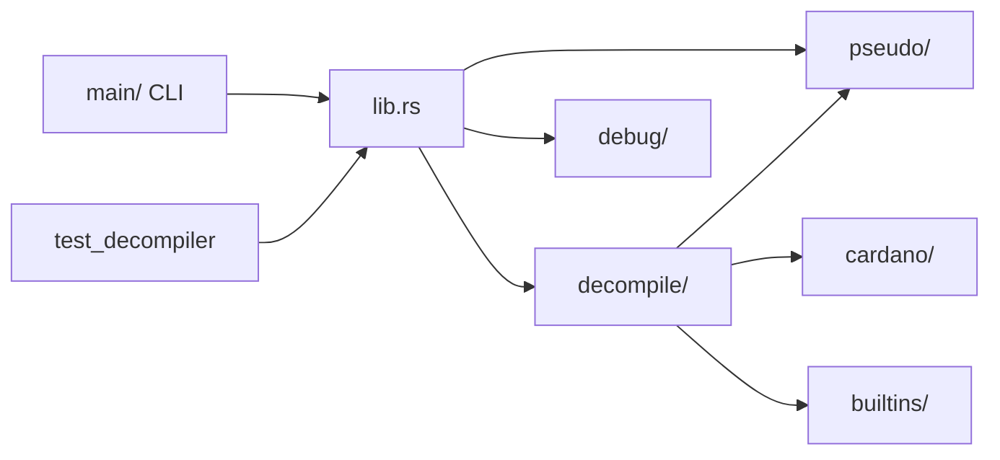
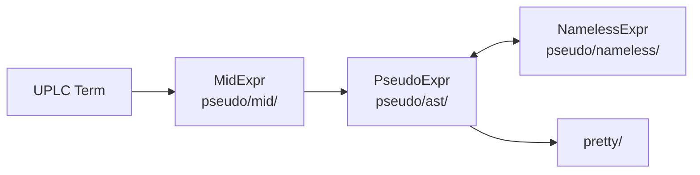
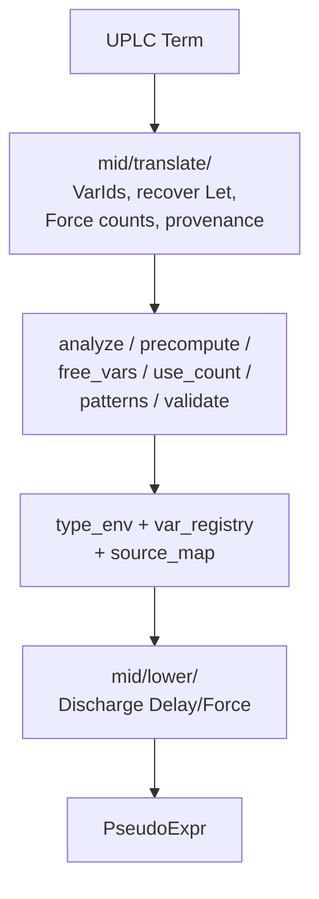
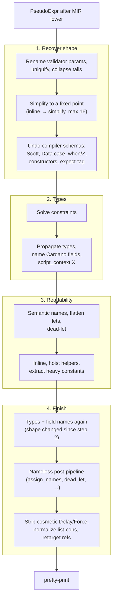
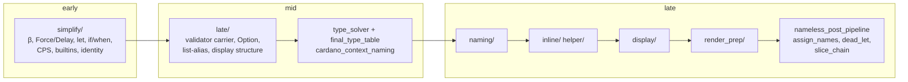
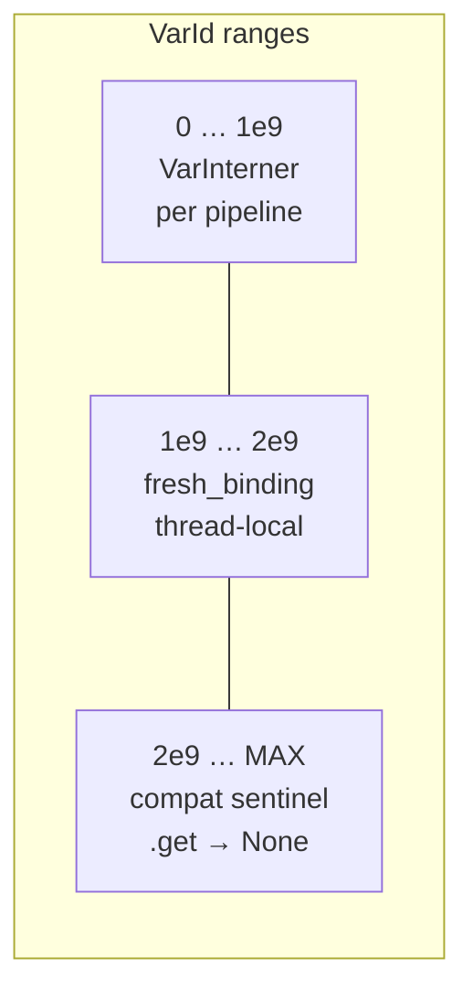

# dehosk — Architecture

Hex-encoded UPLC → readable pseudocode. Public API: `decompile(hex, options)`.

Inversions: `WHY_IT_WORKS.md`. Options: `OPTIONS.md`.

```
hex → CBOR/Flat → UPLC Term → MidExpr → PseudoExpr → 69 passes → pretty print
```



`cardano/` — blueprint + ScriptContext schema. `builtins/` — `BuiltinId` dispatch. `debug/` — provenance bundle / source map. `error.rs`, `fixtures.rs`, `proptest_tests/` sit beside these.

## Three IRs

Same program, three shapes. Pipeline is **MIR → Pseudo**. Nameless is a round-trip overlay (not a stored snapshot): names live in a side `VarTable`, so rewrites cannot shadow or orphan by string.



| IR | Why it exists |
|---|---|
| **MIR** | Near-1:1 with UPLC. `Delay`/`Force` still explicit. Analysis, precompute, types run **before** machine semantics are lost |
| **Pseudo** | High-level AST that is pretty-printed. Still carries leftover `Delay`/`Force` |
| **Nameless** | `VarId` only; `VarKind` replaces name-pattern dispatch. Default production segment |

MIR is the execution-aware layer: it follows CEK order (thunks, `Force`, closures), so constant folding, Force/Delay pairing, use-counts and the type env run **before** surface syntax exists (`pseudo/mid/expr`, `decompile/mid/{translate,analyze,precompute,lower}`). Lowering is *meant* to strip laziness entirely; it does not. Residue `Delay`/`Force` survives into Pseudo (raw-pseudo still prints `delay(force(...))`), and `strip_cosmetic_delays` / `cancel_force_delay_vars` clean up what is left. Types: the enums in those modules, not a separate design doc.

Supporting: `var_id/`, `fold/` + `walker/`, `constructor/`, `field_selector/`, `root_layout/`, `abstract_value/`. Nameless: `convert/` (round-trip), `invariants/`, `fold.rs`.

## Translation: UPLC → Pseudo



`recognize_patterns` always runs in MIR precompute. Unresolved `Force` survives into Pseudo. `basic/` is not a translator — only `convert_plutus_data`. Lineage: `pseudo_lineage/` (`PseudoNodeId` / `MidExprId` ↔ UPLC `uniq_id`).

## Pipeline

69 passes, **manually ordered** (`pipeline/mod.rs`, `pipeline_stages/mod.rs`). `PipelineExecutor` checks contracts; order is not derived. Missing `requires` panics, naming the property. Fixed-point cap: 16.

Why this order: recover the *shape* first, then types can name fields, then names/flattening are safe, then a last type pass and nameless display.



Each pass declares `requires` / `produces` / `invalidates` over seven properties: `RenamedVariables`, `UniqueLetNames`, `ValidatorParamNamesRenamed`, `TypeConstraintsSolved`, `TypesPropagated`, `CardanoFieldNamesResolved`, `ConsistentRefIds`. Type solve **invalidates** `TypesPropagated`, so field-name resolution cannot run until propagate runs again. Stale `VarId` refs have one allowlisted repair (`retarget_refs_by_scope`).

Naming is two-phase: **semantic** in step 3 (rewrites still match names) then **render** after the shape is final. `safe_mode` skips the riskier boxes in 1 and 3; simplify and types still run.

## Where a rewrite lives



`safe_mode` skips the riskier recovery/polish clusters; simplify and types still run. Per-pass toggles: `OPTIONS.md`.

Nameless is the production path. `kind_inference` verifies `VarKind` in debug (`debug_assert!`); release is a no-op.

Domain wrap (not a rewrite): `validator_shape/` + `validator_meta/` → `validator NAME { spend/mint/… }`. Polarity: `church_polarity.rs`, `polarity_oracle.rs`.

## Identity and stack

Structural passes key on **`VarId`, not `name`**. Names are a render concern. Thread-local allocators so parallel `decompile_program` cannot drift (`corpus_idempotence_concurrent_decompile`).



AST: `Var.id` / `Let.id` are `Option<VarId>` (`None` = symbolic/compat). `Binder.id` is always concrete.

Recursion is deep: `stacker` (512 KiB red zone, 16 MiB) in `pseudo/fold`, MIR fold/translate/lower; `simplify/transform` goes through `self.fold`. `decompile()` itself runs on a 64 MiB thread.
